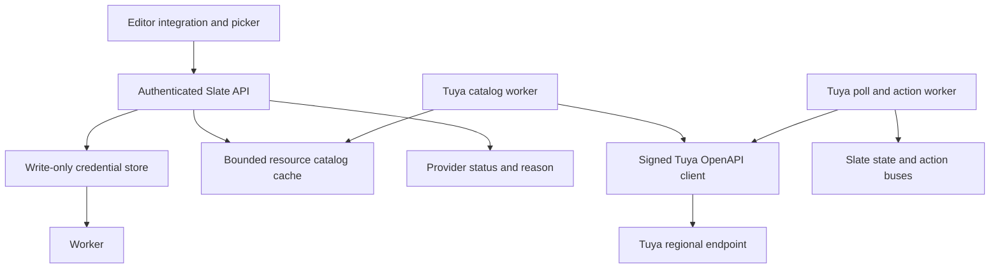
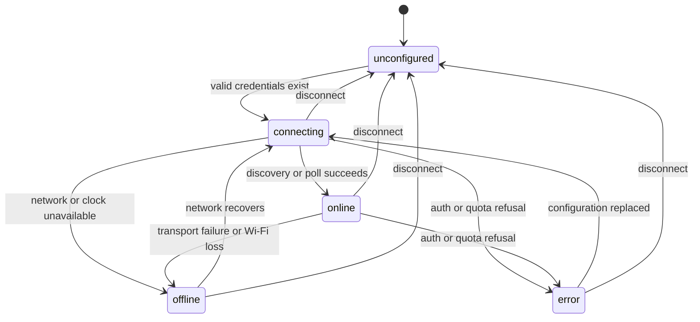
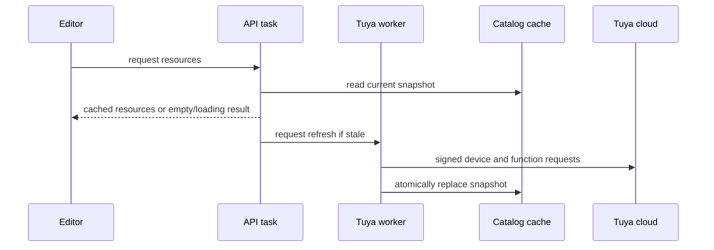

# Tuya Provider Completion - Plan

## Goal Capsule

- **Objective:** A Slate panel can be configured from the editor to discover, display, and control supported Tuya or Smart Life devices through the official Tuya cloud without another process running.
- **Means:** Complete and harden the existing `slate_tuya` implementation, preserve the approved polling/provider architecture, and close the compile, lifecycle, security, catalog, action, and verification gaps identified in the current branch (KTD1-KTD7).
- **Authority:** The approved design remains authoritative except for the two explicit catalog amendments in Scope Boundaries: independently bindable humidity uses a Slate-only suffix, and resources the typed picker cannot represent are omitted. This completion plan records and supersedes those two origin clauses. Current official Tuya cloud documentation is authoritative for the external protocol; existing Slate provider and API contracts are authoritative for integration mechanics.
- **Stop conditions:** Stop if the current Tuya OpenAPI cannot support a required device flow, if satisfying a requirement would expose stored secrets, or if the change cannot fit the firmware partition or API route budget.
- **Execution profile:** Code implementation with host/editor checks, an ESP-IDF firmware build when the toolchain is available, and real-device validation called out separately.
- **Tail ownership:** This run owns implementation, review fixes, commits, push, PR creation, and CI follow-through.

---

## Product Contract

### Summary

Finish the native `tuya` provider already present on the branch so supported lights, covers, temperature/humidity sensors, and metered plugs are discoverable by friendly name and polled into Slate state; supported lights and covers are controlled through semantic actions. Access ID and Access Secret remain write-only, while authenticated reads may return region and UID, and failures remain isolated to Tuya resources.

### Problem Frame

The current branch contains the intended provider, editor card, wiring, and documentation, but it does not compile and several important flows are incorrect or unfinished. Shipping it as-is would break humidity bindings and power-off actions, perform slow cloud work on the shared HTTP task, lose configuration updates under races, and fail to expose the error reasons promised by the approved design.

### Requirements

**Cloud protocol and credentials**

- R1. Tuya requests use the current official HMAC-SHA256 signing contract, bounded HTTPS responses, token refresh near 80% of lifetime, and one token-rejection retry.
- R2. Region, Access ID, Access Secret, and app-account UID are validated before replacing a working configuration and are stored behind dedicated NVS accessors that generic settings APIs cannot read; only region and UID are returned by authenticated configuration reads.
- R3. Configuration replacement and disconnect are race-safe, and in-memory or parsed secret material is wiped when no longer needed.

**Discovery and state**

- R4. The picker lists only resources the provider can publish, using Tuya friendly names, reportable status schema for readings, and command function schema for actions wherever category alone is insufficient.
- R5. Temperature and humidity from one physical device are represented as independently bindable Slate resources while cloud requests always use the unsuffixed Tuya device ID.
- R6. Only bound devices are polled on the five-second cadence, and a Tuya outage stales only Tuya resources.

**Actions and lifecycle**

- R7. Supported light and cover actions preserve boolean false values, perform inverse DP scaling, report delivery, and trigger a prompt follow-up poll.
- R8. Provider state moves through `unconfigured`, `connecting`, `online`, `offline`, and `error` consistently across startup, Wi-Fi loss, cloud failures, recovery, replacement, and disconnect.
- R9. Authentication and quota failures are distinguishable through the status API and editor-facing diagnostics without exposing provider secrets.

**User and repository integration**

- R10. The editor can load, connect, replace, and disconnect Tuya configuration while clearing credential inputs after successful mutations.
- R11. Firmware wiring, route registration, generated-editor size, documentation, reset wording, and network/security claims all include Tuya without exceeding existing budgets.

### Key Decisions

- **Official cloud API only.** Local Tuya protocols and the undocumented Smart Life app API are excluded. Governs R1, R2.
- **Native provider with polling.** The panel owns Tuya access and polls bound devices rather than requiring a bridge or cloud message queue. Governs R4, R6, R7.
- **Friendly-name discovery.** Users select supported resources from the existing picker instead of entering device IDs. Governs R4, R10.
- **Provider-local failure isolation.** Tuya connectivity never changes the freshness of another provider's resources. Governs R6, R8.

### Acceptance Examples

- AE1. Given valid EU project credentials and a supported dimmable light, when the user connects Tuya and opens the picker, the light appears by its app name and can be turned both on and off.
- AE2. Given a temperature/humidity sensor, when both readings are bound, the provider polls the physical device by its Tuya ID and publishes distinct temperature and humidity resources.
- AE3. Given working stored credentials, when a replacement submission fails validation or an earlier validation completes after disconnect, the prior intentional configuration state remains unchanged.
- AE4. Given a network outage, expired authorization, or exhausted Tuya quota, when the provider next contacts the cloud, status reports `offline`, auth error, or quota error respectively and non-Tuya resources remain fresh.
- AE5. Given a plain unmetered plug in a Tuya category also used by metered plugs, when the catalog refreshes, the plug is not offered as a power sensor.

### Scope Boundaries

- In scope: official Tuya OpenAPI transport, token lifecycle, supported DP mapping, provider polling/actions, resource catalog, status reasons, editor configuration, firmware wiring, tests, and documentation.
- **Amendment to the origin design:** humidity uses a documented `/humidity` suffix when one physical sensor must expose two Slate sensor bindings. This is a Slate resource identifier, not a Tuya device identifier; the unsuffixed temperature binding remains compatible with the origin's raw-ID rule.
- **Amendment to the origin design:** unsupported or schema-incomplete devices are omitted from the typed picker because the current resource contract has no honest `unknown` kind and no manual-ID fallback. Logs and documentation explain the omission. Existing valid raw-ID bindings remain valid; no persisted binding migration is required.

#### Deferred to Follow-Up Work

- Real-device coverage beyond the initial light, cover, temperature/humidity sensor, and metered-plug fixtures.
- Adaptive polling if measured quota usage requires it.

#### Outside This Product's Identity

- Tuya message-queue push, local/TinyTuya control, and Tuya scenes or automation synchronization.

---

## Planning Contract

### Key Technical Decisions

- KTD1. **Keep protocol construction isolated in `slate_tuya_client`.** Signing and token logic stays behind the client interface and is checked against Tuya's current signing examples so lifecycle code never handles signature details.
- KTD2. **Keep all cloud I/O on dedicated provider worker paths.** Catalog callbacks serve a credential-epoch-keyed `empty`, `loading`, `ready`, or `error` cache with coalesced refresh and stale-while-refresh behavior. Catalog discovery has its own worker because a device-list request plus one specification request per device can consume repeated 10-second client timeouts, while the action bus has a three-second delivery deadline. The shared HTTP task never performs TLS or holds a catalog lock across network calls.
- KTD3. **Separate Tuya device identity from Slate resource identity with one bounded codec.** Encode/decode helpers round-trip synthetic readings, reject malformed or over-limit IDs, and return an unsuffixed cloud ID without truncation.
- KTD4. **Represent status and reason as one provider-neutral atomic value.** Extend both REST and WebSocket provider serialization with a bounded optional reason whose stable values include auth and quota; every non-error transition clears it and legacy providers omit it.
- KTD5. **Serialize configuration intent and persistence atomically.** Every POST and DELETE advances an epoch, and compare-and-persist uses the same mutation lock as disconnect so no intent can land between the freshness check and NVS write.
- KTD6. **Derive every catalog entry from the device specification.** Readable sensor capabilities come from the specification's reportable `status` schema and actionable capabilities from its `functions` schema. A resource is advertised only when the relevant schema proves the reading or action can be published; discovery has an explicit resource cap and rejects over-cap results without publishing a partial catalog.
- KTD7. **Constrain signed requests to the selected regional origin.** User/cloud identifiers are validated as path segments, automatic redirects are disabled, and only expected 2xx responses with valid Tuya result semantics can acknowledge an action.

### High-Level Technical Design

### Assumptions

- The two Scope Boundaries amendments supersede the corresponding raw-ID and unsupported-device clauses in the origin design; U5 updates that document so the repository has no contradictory active contract.
- A minimal optional provider-reason field is acceptable on `/status`; existing consumers tolerate additional JSON fields.
- ESP-IDF v5.5.5 is the firmware target, while local availability of that toolchain is determined during execution.

### Risks & Dependencies

- Tuya's external API, product subscriptions, device categories, and DP vocabularies can differ by project and device model; fixtures reduce mapping risk but real hardware remains the final compatibility proof.
- A full firmware build may require generated fonts and editor assets plus the ESP-IDF toolchain described in `CONTRIBUTING.md`.
- The completed tree is expected to register 35 of 36 configured HTTP handlers, so initialization must prove every registration succeeds and retain the single spare slot.
- Cloud catalog responses must stay within the client's response cap; oversize responses fail visibly rather than producing partial discovery.
- Slate's editor submits credentials to the panel over its existing LAN HTTP API; signed HTTPS protects only the panel-to-Tuya hop, and the documentation must not imply end-to-end TLS.

### System-Wide Impact

- **State contract:** Provider status and reason update atomically. REST provider entries gain optional `reason`; WebSocket status frames retain the existing `providers` string map and gain an optional parallel `provider_reasons` map. Old editors ignore both additions, new editors accept their absence, and recovery removes a stale reason.
- **Task ownership:** Bound-device polling/actions and catalog discovery use separate Tuya-owned workers so neither the HTTP server nor the action deadline waits on account-wide discovery.
- **Credential lifecycle:** NVS persistence, validation jobs, client buffers, parsed JSON, signing scratch, tokens, and logs are part of the secret boundary; compiler-resistant wiping covers each owned copy on success and failure paths, and secrets are never deliberately logged or serialized.
- **Mutation barrier:** Every queued request and result carries the credential epoch. POST and DELETE complete only after earlier-epoch work can no longer issue a cloud request, publish state, acknowledge an action, or replace cached data.
- **Action timing:** Actions take priority over polling, use a proactively refreshed token, and must produce a cloud delivery result inside the action bus's three-second deadline. A missing usable token or a request that cannot fit the remaining deadline fails promptly; follow-up polling and late cloud responses are asynchronous and cannot reverse that result.
- **Outbound boundary:** Regional hosts are an allowlist, redirects are refused, and dashboard or cloud identifiers cannot alter signed paths.

### Sources & Research

- Approved product design: `docs/superpowers/specs/2026-09-09-tuya-cloud-provider-design.md`.
- Prior task decomposition and handoff evidence: `docs/superpowers/plans/2026-09-09-tuya-cloud-provider.md` and `.superpowers/sdd/2026-09-09-tuya-cloud-provider/`.
- Existing patterns: `firmware/components/slate_ha/slate_ha.c`, `firmware/components/slate_shelly/slate_shelly.c`, `firmware/components/slate_state/`, and `firmware/components/slate_api/`.
- Tuya, "Sign Requests for Cloud Authorization," updated 2026-01-05: `https://developer.tuya.com/en/docs/iot/new-singnature?id=Kbw0q34cs2e5g`.
- Tuya, "Request Structure" and regional endpoints: `https://developer.tuya.com/en/docs/iot/api-request?id=Ka4a8uuo1j4t4`.

---

## Implementation Units

### U1. Correct and test Tuya protocol and mapping primitives

- **Goal:** Make signing, token/error classification, DP conversion, and command construction independently reviewable and deterministic.
- **Requirements:** R1, R4, R7.
- **Dependencies:** None.
- **Files:** `firmware/components/slate_tuya/slate_tuya_client.c`, `firmware/components/slate_tuya/include/slate_tuya_client.h`, `firmware/components/slate_tuya/slate_tuya_map.c`, `firmware/components/slate_tuya/include/slate_tuya_map.h`, `firmware/components/slate_tuya/test/` if a durable host seam is practical.
- **Approach:** Preserve KTD1 and KTD7 and compare generated signatures with the official token and business-call vectors. Keep category-independent scaling tests on the host, including false boolean values and ambiguous plug categories.
- **Execution note:** Start with deterministic fixtures for every pure protocol or mapping path before changing implementation.
- **Patterns to follow:** Existing pure-state selftests and the current throwaway mapping harness captured in `.superpowers/sdd/2026-09-09-tuya-cloud-provider/task-2-report.md`.
- **Test scenarios:**
  - Official empty-body token vector produces the documented uppercase HMAC and canonical URL.
  - Business request signing includes the access token and body hash while token signing does not.
  - Brightness and color-temperature boundary values round-trip through normalized and Tuya ranges.
  - Power `false` remains a present boolean and emits a false command value.
  - Token expiry, auth codes, quota codes, request-time errors, HTTP throttling, and malformed envelopes receive the intended classifications.
  - Redirects and non-2xx responses cannot be treated as successful Tuya envelopes or action acknowledgements.
- **Verification:** Deterministic host or compile-time fixtures pass without network access and all changed C compiles warning-free in the firmware build.

### U2. Make resource identity, discovery, and catalog refresh correct

- **Goal:** Ensure every advertised resource can be polled and that catalog cloud I/O cannot stall the shared API task.
- **Requirements:** R4, R5, R6.
- **Dependencies:** U1.
- **Files:** `firmware/components/slate_tuya/slate_tuya.c`, `firmware/components/slate_tuya/include/slate_tuya.h`, `firmware/components/slate_tuya/CMakeLists.txt`, `firmware/components/slate_api/slate_api.c`.
- **Approach:** Apply KTD2, KTD3, and KTD6. Complete the dedicated catalog worker and cache state machine, fetch each device specification, use the identity codec for every synthetic reading, gate readings on reportable status and actions on functions, enforce the resource cap, and remove the API task stack increase once TLS no longer runs there. `GET /resources` adds `catalog_state`; it returns promptly with `loading` and no resources on a cold cache, keeps the last complete resources while `loading` during stale refresh, and returns `error` with no partial replacement after a cold failure. The editor polls a loading catalog with a bounded backoff, renders stale resources with a refreshing note, renders ready-empty distinctly, and offers retry after error; Tuya has no manual-ID fallback.
- **Patterns to follow:** Worker-owned networking and pointer-swap handoff in `firmware/components/slate_shelly/slate_shelly.c`; catalog registration in `firmware/components/slate_api/slate_api.c`.
- **Test scenarios:**
  - Covers AE2. Temperature and humidity bindings share one physical device entry and generate only unsuffixed cloud paths.
  - Maximum-length IDs round-trip exactly, while malformed suffixes and IDs too long for the suffix are rejected without truncation or collision.
  - Covers AE5. An unmetered plug is absent while a plug with `cur_power` appears as a power sensor.
  - A fixture whose read-only temperature/humidity DPs appear in `status` but not `functions` still advertises both readings.
  - A cold or stale catalog request returns promptly, reports the defined cache state, and queues at most one refresh without holding its lock during HTTPS.
  - Account-wide discovery yields between bounded work while bound-device actions and polling remain responsive.
  - Credential replacement invalidates catalog data and the next successful refresh atomically replaces it.
  - Oversize, malformed, auth-failed, and network-failed catalog responses do not publish partial resources.
- **Verification:** Selftests prove resource splitting and cache handoff; code inspection and firmware build prove there is no cloud call on the HTTP handler path.

### U3. Repair provider actions, lifecycle, and status diagnostics

- **Goal:** Make actions and every provider transition match the approved behavior, including distinct auth and quota reasons.
- **Requirements:** R7, R8, R9.
- **Dependencies:** U1, U2.
- **Files:** `firmware/components/slate_tuya/slate_tuya.c`, `firmware/components/slate_tuya/include/slate_tuya.h`, `firmware/components/slate_state/include/slate_state.h`, `firmware/components/slate_state/slate_state.c`, `firmware/components/slate_api/slate_api.c`, `firmware/components/slate_ws/slate_ws.c`.
- **Approach:** Preserve boolean presence separately from value, feed discovery/specification failures into lifecycle classification, publish REST `reason` and WebSocket `provider_reasons` per KTD4, give actions priority with a usable-token and three-second delivery budget, clear status immediately on disconnect, and verify recovery transitions.
- **Patterns to follow:** State/action provider contracts in `firmware/components/slate_state/` and `firmware/components/slate_action/`; provider unavailability handling in `firmware/components/slate_shelly/slate_shelly.c`.
- **Test scenarios:**
  - Covers AE1. `set_power(true)` and `set_power(false)` both dispatch and report success before the follow-up poll clears pending state.
  - Covers AE4. First discovery DNS/TLS failure reports offline rather than generic error.
  - Auth and quota refusals both report error status with different stable reason codes.
  - REST and WebSocket publish the same atomic status/reason pair, clear stale reasons on recovery, and omit the field for legacy providers.
  - Wi-Fi loss reports unavailable once, recovery returns through connecting, and another provider's state is untouched.
  - Disconnect immediately reports unconfigured and rejects queued actions as unavailable.
- **Verification:** Provider/state selftests cover action values and transition sequences; `/status` serialization remains backward compatible for providers without reasons.

### U4. Make credential mutation and initialization safe

- **Goal:** Prevent stale configuration jobs, secret remnants, missing worker resources, and masked initialization failures.
- **Requirements:** R2, R3, R8.
- **Dependencies:** U3.
- **Files:** `firmware/components/slate_store/include/slate_store.h`, `firmware/components/slate_store/slate_store.c`, `firmware/components/slate_tuya/slate_tuya.c`, `firmware/components/slate_tuya/slate_tuya_client.c`, `firmware/main/main.c`, `firmware/main/CMakeLists.txt`.
- **Approach:** Stage initialization so locks, queues, and consumers exist before irreversible registrations expose callbacks or routes. Apply KTD5 under one mutation lock and make mutation completion an epoch barrier for queued and in-flight requests/results. Use compiler-resistant wiping for every owned secret/token copy, validate exact length ceilings, and preserve the first critical failure while retaining registration-first degradation for later network startup.
- **Patterns to follow:** Configuration task and recursive JSON wiping in `firmware/components/slate_ha/slate_ha.c`; private NVS accessors in `firmware/components/slate_store/slate_store.c`.
- **Test scenarios:**
  - Covers AE3. A disconnect during an older in-flight validation prevents that job from restoring credentials.
  - A disconnect between validation completion and persistence still wins because the epoch comparison and NVS commit share the mutation boundary.
  - Two replacements completing out of order leave the newest intentional submission active.
  - Worker or queue allocation failure leaves POST unavailable safely and makes initialization report the failure.
  - Partial or over-limit stored tuples are treated as unconfigured and generic getters refuse every credential key.
  - Parsed Access ID and Access Secret storage is zeroed before release on success and every error exit.
  - GET returns exactly `configured`, `region`, and `uid`; Access ID, Access Secret, access token, and refresh token never appear in responses, logs, or freed owned buffers.
  - GET, POST, and DELETE reject absent/invalid device-admin tokens, integration keys, and setup-AP access.
- **Verification:** Store/provider selftests exercise mutation ordering and secret access boundaries; the firmware build confirms initialization names and scopes are valid.

### U5. Finish editor flows and user-facing contracts

- **Goal:** Make Tuya configuration understandable and ensure client types and reset/security wording match the firmware contract.
- **Requirements:** R9, R10, R11.
- **Dependencies:** U3, U4.
- **Files:** `editor/src/lib/api.ts`, `editor/src/lib/providers.ts`, `editor/src/ui/IntegrationsDialog.tsx`, `editor/src/ui/DevicePanel.tsx`, `editor/tests/`, `README.md`, `SECURITY.md`, `docs/API.md`, `docs/CONFIGURATION.md`, `docs/DESIGN.md`, `docs/superpowers/specs/2026-09-09-tuya-cloud-provider-design.md`.
- **Approach:** Align editor error mapping with stable REST/WebSocket status reasons, render a Tuya-specific auth/quota reason beside the provider status with an accessible live announcement, implement the four catalog picker states and retry contract from U2, clear credential fields after successful mutations, include Tuya in reset confirmation, and update the origin design to record the two explicit Scope Boundaries amendments plus identifier-versus-secret wording and the LAN HTTP submission boundary.
- **Patterns to follow:** Home Assistant integration UI and API tests in `editor/src/ui/IntegrationsDialog.tsx` and `editor/tests/ha.test.ts`; measured prose in existing provider documentation.
- **Test scenarios:**
  - Connect sends the four required fields, refreshes configuration, clears credential inputs, and exposes resources.
  - Auth, quota, network, busy, and malformed-field codes produce distinct actionable messages.
  - Disconnect confirmation clears configuration and both credential inputs while leaving a sensible region default.
  - Status responses with and without optional reasons are accepted by editor types and existing provider rendering.
  - REST load and WebSocket updates show distinct auth/quota reasons on the Tuya card, clear them on recovery, and announce changes through a live region.
  - Loading, ready-empty, stale-refreshing, and error/retry catalog states render distinctly without exposing a manual Tuya ID field.
  - Security and design docs distinguish identifiers returned by GET from secrets that never leave the device through Slate APIs.
- **Verification:** Type-check, editor tests, production build, and generated single-file size budget pass; docs contain no contradicted LAN-only or credential claims.

### U6. Run integrated verification and prepare the shipping diff

- **Goal:** Prove the completed branch is buildable, reviewable, and honest about real-device limits.
- **Requirements:** R1-R11.
- **Dependencies:** U1-U5.
- **Files:** All files changed by U1-U5; generated firmware/editor outputs remain uncommitted as required by repository policy.
- **Approach:** Run repository checks from a clean dependency state, build generated editor assets before firmware, audit route and partition budgets, review the final diff for secrets or abandoned code, and record real-device work as a PR verification note rather than pretending it ran.
- **Patterns to follow:** `CONTRIBUTING.md` build and review workflow.
- **Test scenarios:**
  - All deterministic protocol, mapping, store, state, provider, and editor checks pass together.
  - The editor bundle remains below the firmware gzip budget.
  - Firmware compiles with ordinary settings and with the Tuya selftest enabled when ESP-IDF v5.5.5 is available.
  - Route registration remains within `SLATE_API_MAX_URI_HANDLERS` and application partition usage remains within the configured slot.
  - A secret-pattern scan and final diff inspection reveal no credentials, generated bundles, or temporary harness artifacts.
- **Verification:** Every applicable row in the Verification Contract passes, or a hardware/toolchain-only row is explicitly reported as unrun with the exact follow-up needed.

---

## Verification Contract

| Surface | Command or check | Proves | Applies to |
|---|---|---|---|
| Diff hygiene | `git diff --check` | No whitespace or patch-format defects | U1-U6 |
| Editor type safety | `cd editor && npm run check` | API types and React code compile | U5 |
| Editor behavior | `cd editor && npm test` | Existing and added client contracts pass | U5 |
| Editor artifact | `cd editor && npm run build` plus gzip-size check | Production single-file output fits the 409600-byte budget | U5, U6 |
| Host primitives | Tuya host fixture harness under `-Wall -Wextra` | Mapping and any extracted signature fixtures are deterministic | U1, U2 |
| Firmware | `tools/fonts/generate.sh`, `tools/editor/build.sh`, then `cd firmware && idf.py build` | Component wiring, C compilation, linking, and image size | U1-U6 |
| Firmware selftest | Firmware build with `SLATE_TUYA_SELFTEST=1` | Resource identity, provider seams, and fixtures compile and execute on device | U1-U4 |
| Contract budgets | Route-registration count and firmware size report | API handler and partition ceilings remain valid | U4, U6 |
| Hardware smoke | Configure a real Tuya project and exercise one device per supported class | External service compatibility beyond fixtures | U6; manual follow-up if hardware is unavailable |

---

## Definition of Done

- Every requirement is implemented or explicitly stopped by a Goal Capsule condition.
- U1-U5 verification scenarios are covered by durable tests where the repository has a runnable seam.
- All locally applicable Verification Contract checks pass and unavailable ESP-IDF or hardware checks are named precisely in the PR.
- The approved design and public documentation match the implemented resource, credential, network, and status contracts.
- No secret, generated editor bundle, temporary test dependency, or abandoned experimental path remains in the diff.
- Review findings are fixed or recorded as explicit residuals in the PR body.
- The branch is committed, pushed, and represented by an open PR.
